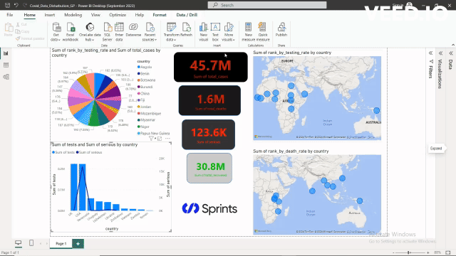
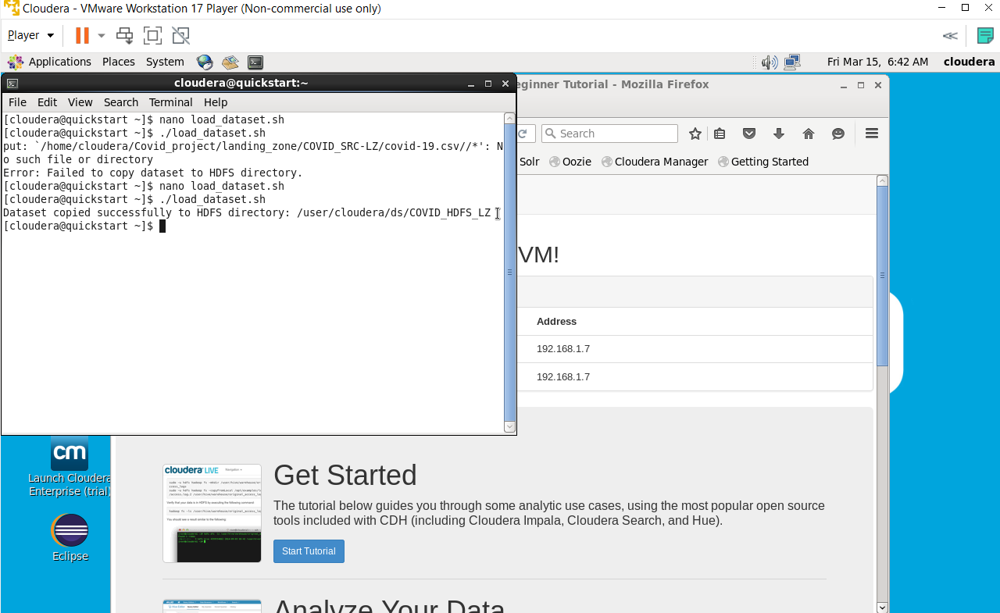
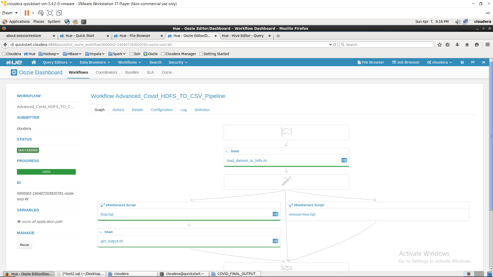

 

# Covid_Analysis From Ingestion to Visualization
Create an automated pipeline from Ingestion using HDFS Hive hql script and Oozie workflow to Visualization using Power BI

# Steps

- Transfer dataset from local machine to the virtual machine using appropriate tool as WIN SCP
- Load dataset from virtual machine document to Cloudera HDFS by creating a shell script load_dataset_to_hdfs.sh
  
- EXTRACT: Extract data from the covid-19.csv file to created tables.

  
- LOAD: Load the data extracted to make the Staging, Partitioning, Final_Output stages.
- TRANSFORM: Transform the data using HQL and hive commands to create tables for each stage with their characteristics.
- AUTOMATE: Automate these ETL process to be used for any desired csv file.

- VISUALIZE: Show on a map the top 10 ranking countries in death rate and in testing rate, and show the top 10 ranking countries in testing rate on a pie chart on a Power BI dashboard
  
  []

